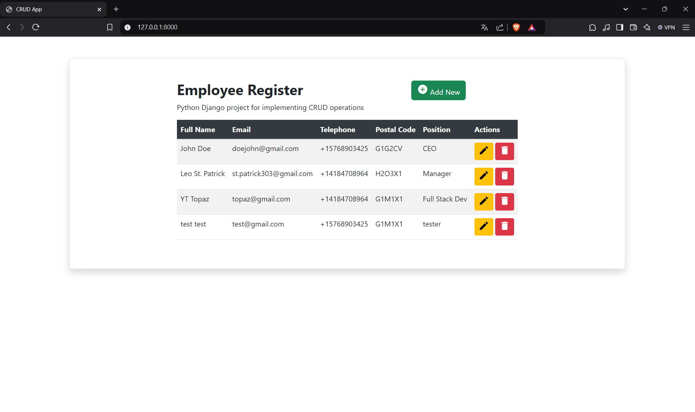
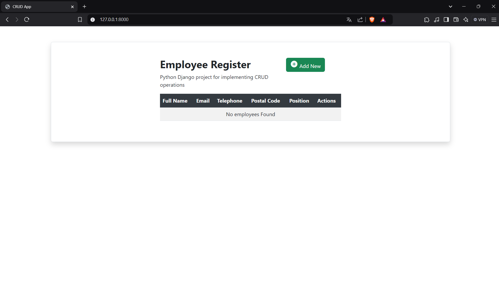
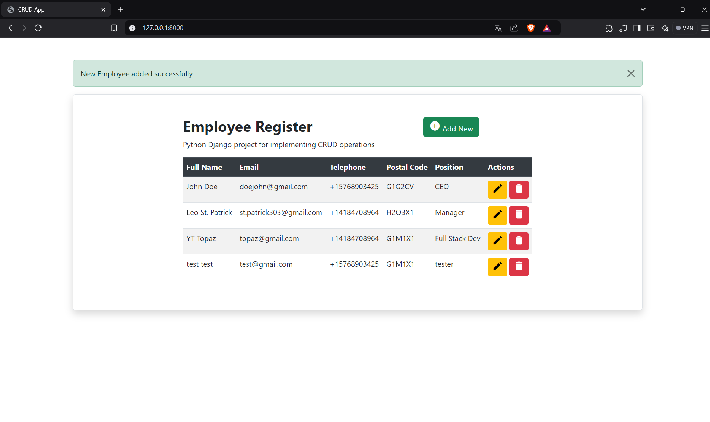
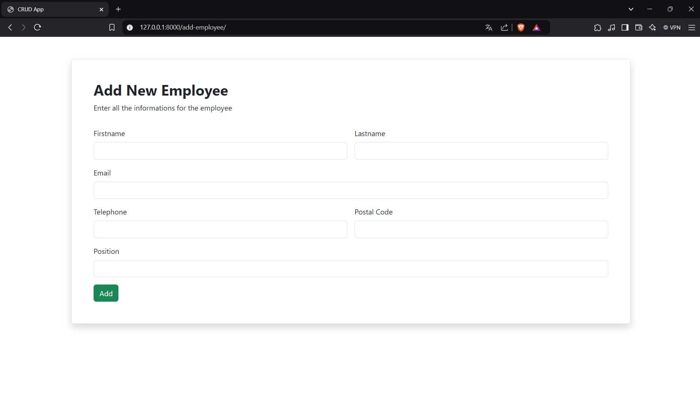
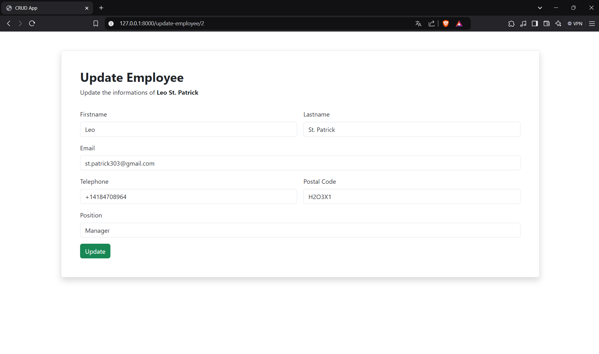

# Django CRUD Application
This is a simple Django-based web application that demonstrates basic CRUD (Create, Read, Update, Delete) operations. The app is designed to manage records, such as entries of a new employee (Full name, Email, Telephone, ...), in an easy-to-use web interface.

## Features
- Create: Add new entries with relevant information.
- Read: View a list of all entries in a clean, organized table format.
- Update: Edit existing entries to keep data up-to-date.
- Delete: Remove entries that are no longer needed.
- Responsive Design: The application is designed with Bootstrap for a mobile-friendly, responsive layout.
- User-Friendly Interface: Simple navigation for quick access to CRUD operations.

## Employee Table 


## Employee empty Table 


## Successfully Added an employee


## Add Employee Page


## Update Employee Page 


## Technologies Used
- Backend: Django (Python)
- Frontend: HTML, CSS, Bootstrap
- Database: SQLite (default Django database, can be swapped with other databases)
- Icons: Material Icons for user-friendly operation buttons

  ## How to Run the Project
  1. Clone the repository:
   ``` bash
  git clone https://github.com/Lil-Code30/django-ecommerce.git
  ```
  2. Navigate to the project directory:
   ``` bash
  cd django-crud-app
  ```
  3. Create a virtual environment (optional but recommended):
   ``` bash
  python -m venv venv
  source venv/bin/activate  # On Windows, use `venv\Scripts\activate`
  ```
  4. Install dependencies:
   ``` bash
  pip install -r requirements.txt
  ```
  5. Run database migrations:
   ``` bash
  python manage.py migrate
  ```
  ## superuser logins for django administration
  ``` bash
  username: root
  password: 123456
  ```
## How to Use
- Navigate to the homepage to view all entries.
- Use the "Add New" button to create a new record.
- Click the "Edit" icon to modify an existing entry.
- Click the "Delete" icon to remove an entry.
  
## Future Improvements
- ...
